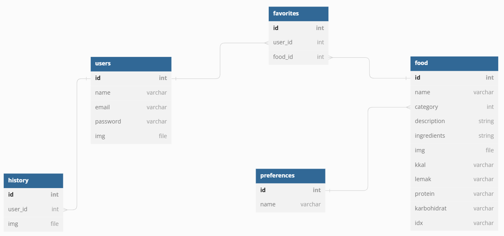

# Recipe Finders API Documentation

This API documentation provides information about the endpoints available in the Recipe Finders API.

# Database Structure


## Base URL

The base URL for all API endpoints is: `https://backend-dot-recipe-finder-388213.as.r.appspot.com/`

## Authentication

All endpoints require authentication using a valid token. Include the token in the request headers as follows:


## Endpoints Users

### Get All Users
  - Endpoint: /users
  - Method: GET
  - Description: Retrieves information of all users.
  - Authentication: Requires authentication with a valid token.
  - Request Parameters: None
  - Response: Returns an array of user objects.
  - example :
  - Response:
    Status: 200 OK
    Body:
    ```json
    {
      "id": 1,
      "name": "John Doe",
      "email": "john@example.com",
      "img": "http://example.com/images/user1.jpg"
    }

### Get User by ID
  - Endpoint: `/users/:id`
  - Method: GET
  - Description: Retrieves information of a specific user based on the provided ID.
  - Authentication: Requires authentication with a valid token.
  - Request Parameters:
    - `id` (path parameter) - The ID of the user to retrieve.
  - Response: Returns the user object matching the provided ID.
  - Example:
    - Request:
      - URL: `/users/1`
      - Headers:
        - Authorization: {valid_token}
    - Response:
      - Status: 200 OK
      - Body:
        ```json
        [
          {
            "id": 1,
            "name": "John Doe",
            "email": "john@example.com",
            "img": "http://example.com/images/user1.jpg"
          }
        ]
        ```
Berikut adalah dokumentasi yang dibuat berdasarkan contoh router yang Anda berikan:

### Get User by ID
  - Endpoint: `/users/:id`
  - Method: GET
  - Description: Retrieves information of a specific user based on the provided ID.
  - Authentication: Requires authentication with a valid token.
  - Request Parameters:
    - `id` (path parameter) - The ID of the user to retrieve.
  - Response: Returns the user object matching the provided ID.
  - Example:
    - Request:
      - URL: `/users/1`
      - Headers:
        - Authorization:  {valid_token}
    - Response:
      - Status: 200 OK
      - Body:
        ```json
        [
          {
            "id": 1,
            "name": "John Doe",
            "email": "john@example.com",
            "img": "http://example.com/images/user1.jpg"
          }
        ]
        ```

### Delete User
  - Endpoint: `/users/:id`
  - Method: DELETE
  - Description: Deletes a user based on the provided ID.
  - Authentication: Requires authentication with a valid token.
  - Request Parameters:
    - `id` (path parameter) - The ID of the user to delete.
  - Response: Returns a success message upon successful deletion.
  - Example:
    - Request:
      - URL: `/users/1`
      - Headers:
        - Authorization:  {valid_token}
    - Response:
      - Status: 200 OK
      - Body:
        ```json
        {
          "message": "Delete successful"
        }
        ```

### Register User
  - Endpoint: `/users/register`
  - Method: POST
  - Description: Registers a new user with the provided information.
  - Request Body:
    - `name` (string) - The name of the user.
    - `email` (string) - The email of the user.
    - `password` (string) - The password of the user.
    - `img` (file) - Optional. An image file for the user's profile picture.
  - Response: Returns a success message and the ID of the inserted user upon successful registration.
  - Example:
    - Request:
      - URL: `/users/register`
      - Headers:
        - Content-Type: application/json
      - Body:
        ```json
        {
          "name": "John Doe",
          "email": "john@example.com",
          "password": "password123"
        }
        ```
    - Response:
      - Status: 201 Created
      - Body:
        ```json
        {
          "message": "User inserted successfully",
          "insertId": 1
        }
        ```

### Login User
  - Endpoint: `/users/login`
  - Method: POST
  - Description: Authenticates a user based on the provided email and password.
  - Request Body:
    - `email` (string) - The email of the user.
    - `password` (string) - The password of the user.
  - Response: Returns a success message, the user data, and an authentication token upon successful login.
  - Example:
    - Request:
      - URL: `/users/login`
      - Headers:
        - Content-Type: application/json
      - Body:
        ```json
        {
          "email": "john@example.com",
          "password": "password123"
        }
        ```
    - Response:
      - Status: 200 OK
      - Body:
        ```json
        {
          "message": "Login Successful",
          "data": {
            "id": 1,
            "name": "John Doe",
            "email": "john@example.com",
            "img": "http://example.com/images/user1.jpg"
          },
          "token": "{authentication_token}"
        }
        ```

### Update User Password
  - Endpoint: `/editpass/:id`
  - Method: PUT
  - Description: Updates the password of a user based on the provided ID and old password.
  - Authentication: Requires authentication with a valid token.
  - Request Parameters:
    - `id` (path parameter) - The ID of the user to update.
  - Request Body:
    - `oldpassword` (string) - The old password of the user.
    - `password` (string) - The new password of the user.
  - Response: Returns a success message upon successful password update.
  - Example:
    - Request:
      - URL: `/editpass/1`
      - Headers:
        - Authorization:{valid_token}
        - Content-Type: application/json
      - Body:
        ```json
        {
          "oldpassword": "oldpassword123",
          "password": "newpassword123"
        }
        ```
    - Response:
      - Status: 200 OK
      - Body:
        ```json
        {
          "message": "Password updated successfully"
        }
        ```

### Update User Image
  - Endpoint: `/editimage/:id`
  - Method: PUT
  - Description: Updates the image of a user based on the provided ID.
  - Authentication: Requires authentication with a valid token.
  - Request Parameters:
    - `id` (path parameter) - The ID of the user to update.
  - Request Body:
    - `img` (file) - The new image file for the user's profile picture.
  - Response: Returns a success message upon successful image update.
  - Example:
    - Request:
      - URL: `/editimage/1`
      - Headers:
        - Authorization:  {valid_token}
      - Body:
        - Form Data:
          - `img` (file): [image file]
    - Response:
      - Status: 200 OK
      - Body:
        ```json
        {
          "message": "Users updated successfully"
        }
        ```

### Update User Email and Image
  - Endpoint: `/users/:id`
  - Method: PUT
  - Description: Updates the email and image of a user based on the provided ID.
  - Authentication: Requires authentication with a valid token.
  - Request Parameters:
    - `id` (path parameter) - The ID of the user to update.
  - Request Body:
    - `email` (string) - The new email of the user.
    - `img` (file) - The new image file for the user's profile picture.
  - Response: Returns a success message upon successful update.
  - Example:
    - Request:
      - URL: `/users/1`
      - Headers:
        - Authorization:  {valid_token}
      - Body:
        - Form Data:
          - `email` (string): john.doe@example.com
          - `img` (file): [image file]
    - Response:
      - Status: 200 OK
      - Body:
        ```json
        {
          "message": "Users updated successfully"
        }
        ```

## Endpoints Food
......
## Endpoints Favorite
....
## Endpoints History
....
## Endpoints Preferences

